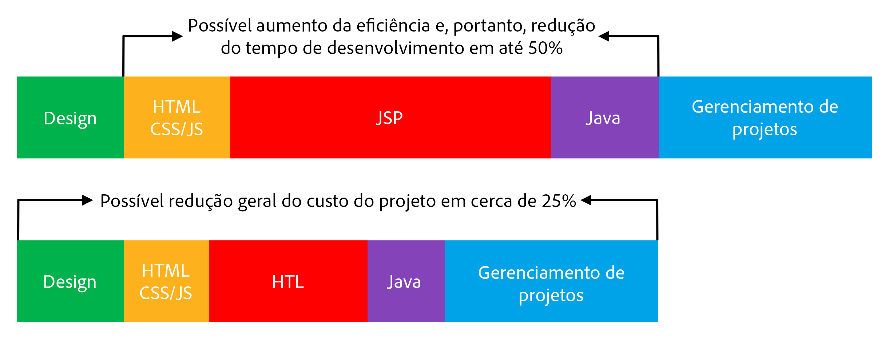

# Visão geral {#overview}

>[!TIP]
>
>**Já considerou utilizar o Edge Delivery Services para AEM?**
>
>Você pode continuar usando os métodos descritos neste documento para projetos existentes. No entanto, para novos projetos, a Adobe recomenda aproveitar o [Edge Delivery Services.](https://experienceleague.adobe.com/pt-br/docs/experience-manager-cloud-service/content/edge-delivery/overview)

A Linguagem de modelo HTML (HTL), compatível com o Adobe Experience Manager (AEM), tem como objetivo fornecer uma estrutura corporativa da Web altamente produtiva que aumenta a segurança. Ela também permite que desenvolvedores de HTML sem conhecimento em Java melhor participem de projetos do AEM.

[Introduzida no AEM 6.0](history.md), a Linguagem de modelo HTML é o sistema de modelo do lado do servidor preferencial e recomendado para HTML no AEM. Para desenvolvedores da Web que precisam criar sites corporativos robustos, a Linguagem de modelo HTML ajuda a aumentar a segurança e a eficiência do desenvolvimento.

## Maior segurança {#increased-security}

A Linguagem de modelo HTML (HTL) aumenta a segurança do site aplicando automaticamente o escape com reconhecimento de contexto a todas as variáveis de saída, tornando-a mais segura do que a maioria dos outros sistemas de modelo. A HTL torna isso possível porque compreende a sintaxe HTML e usa esse conhecimento para ajustar o escape necessário para expressões, com base em sua posição na marcação. Esse método pode resultar em expressões colocadas em atributos `href` ou `src` sendo escapadas de maneira diferente das expressões colocadas em outros atributos ou locais.

Embora o mesmo resultado possa ser obtido com linguagens de modelo como o JSP, o desenvolvedor deve garantir manualmente que o escape adequado seja aplicado a cada variável. Como uma única omissão ou erro no escape aplicado possivelmente é suficiente para causar uma vulnerabilidade na criação de script entre sites (XSS), a Adobe decidiu automatizar essa tarefa com a HTL. Se necessário, os desenvolvedores ainda podem especificar um escape diferente nas expressões, mas com a HTL, o comportamento padrão está muito mais propenso a corresponder ao comportamento desejado, reduzindo a probabilidade de erros.

## Desenvolvimento simplificado {#simplified-development}

A Linguagem de modelo HTML é fácil de aprender e seus recursos são limitados de propósito para garantir que permaneça simples e direta. Ela também tem mecanismos poderosos para estruturar a marcação e chamar a lógica, ao mesmo tempo que impõe sempre a separação rigorosa das preocupações entre marcação e lógica. A HTL é o HTML5 padrão, que usa expressões e atributos de dados para anotar a marcação com comportamento dinâmico. Essa abordagem mantém a validade e a legibilidade da marcação. A avaliação das expressões e dos atributos de dados é feita inteiramente no lado do servidor e não estará visível no lado do cliente, onde qualquer estrutura JavaScript desejada pode ser usada sem interferência.

Esses recursos permitem que desenvolvedores de HTML sem conhecimento em Java editem modelos HTL, integrem-se à equipe de desenvolvimento e simplifiquem a colaboração com desenvolvedores Java de pilha completa. E, da mesma forma, isso permite que desenvolvedores Java se concentrem no código de back-end sem se preocuparem com o HTML.

## Menor custo {#reduced-costs}

Para projetos do AEM, maior segurança, desenvolvimento simplificado e melhor colaboração em equipe resultam em menos esforço, um prazo para comercialização (TTM) mais rápido e menor custo total de propriedade (TCO).

A reimplementação do site Adobe.com com a Linguagem de modelo HTML mostrou que os custos e a duração do projeto são reduzidos em até aproximadamente 25%.

O diagrama acima mostra que as seguintes melhorias na eficiência foram possivelmente viabilizadas pela HTL:

* **HTML / CSS / JS:** os desenvolvedores de HTML podem editar diretamente os modelos HTL, permitindo que os designs de front-end sejam implementados diretamente em componentes do AEM, eliminando a necessidade de implementação separada. Essa abordagem reduz iterações negativas com desenvolvedores Java de pilha completa.
* **JSP / HTL:** como a HTL em si não requer conhecimento em Java e é simples de escrever, qualquer desenvolvedor com conhecimento em HTML pode editar os modelos.
* **Java:** graças à API de uso clara e simples de usar fornecida pela HTL, a interface com a lógica comercial é esclarecida, o que também beneficia o desenvolvimento do Java em geral.

## Vídeo de introdução {#video}

O vídeo a seguir, retirado de uma [sessão do AEM Gems](https://experienceleague.adobe.com/pt-br/docs/events/experience-manager-gems-recordings/gems2014/aem-introduction-to-htl), fornece uma visão geral da finalidade do HTL, bem como exemplos de implementação.

>[!VIDEO](https://video.tv.adobe.com/v/19504/?quality=9)

Observe que o vídeo se refere à HTL por [seu antigo nome, Sightly](history.md).

## Próximas etapas {#next-steps}

Agora que você conhece os objetivos e as vantagens da HTL, já pode começar com a linguagem. Consulte [Introdução à Linguagem de modelo HTML](getting-started.md).
